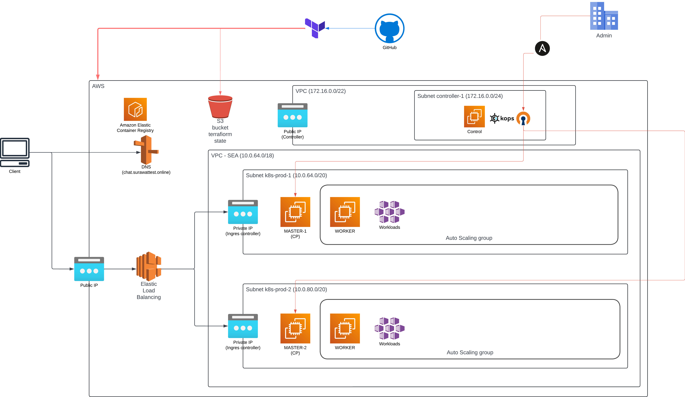
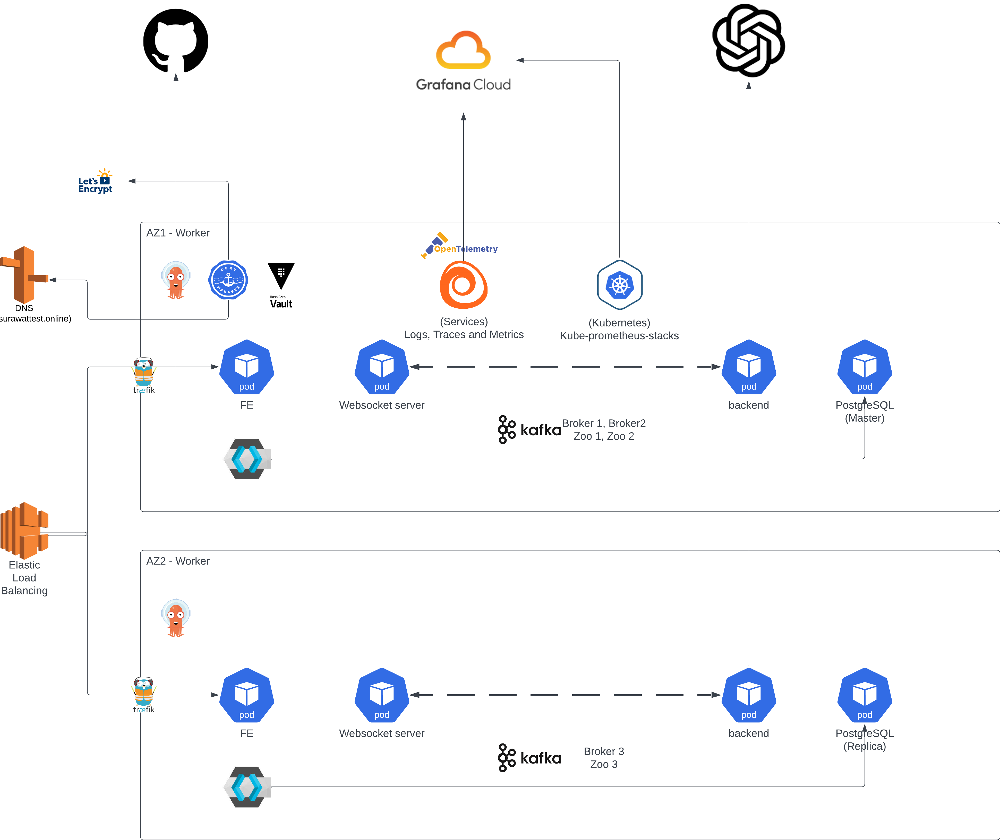

### REPOSITORY STRUCTURE
- cloud-deployment 
    - (IaC for AWS resources)
- ansible 
    - (playbooks for setting up controller vm and creating kubernetes cluster with 'kops')
- ops-deployment
    - (kubernetes deployment manifests for operational services)
- argocd-config 
    - (configurations for ArgoCD)
- app-deployment 
    - (kubernetes deployment manifests for application microservices)
- microservices 
    - (microservices fe + be)
- ops-manual-deployment
    - (manual argocd helm deployment + secrets setup for ops)
---
### Infrastructure Diagrams
#### Cloud Infrastructure


#### Kubernetes Cluster

---

### CLOUD-DEPLOYMENT
#### pre-requirements:
-   github repo
    -   setup github app integration with terraform
-   terraform cloud ( login with github for repo access )
    -   setup organization 'name' and workspace name 'network' with
        -   VCS branch 'non-prod'
        -   Working directory at '/cloud-deployment/network-workspace'
        -   Watch change pattern at '/cloud-deployment/network-workspace/*'
    -   setup workspace name 'controller' with
        -   VCS branch 'non-prod'
        -   Working directory at '/cloud-deployment/controller-workspace'
        -   Watch change pattern at '/cloud-deployment/controller-workspace/*'
        -   Configure 'network' workspace enable 'Remote state sharing' with workspace 'controller'
        
-   AWS account
    -   create IAM user for terraform
        -   get AWS_ACCESS_KEY_ID, AWS_SECRET_ACCESS_KEY, AWS_DEFAULT_REGION=ap-southeast-1 and setup in terraform cloud as terraform-variables 'sensitive' (*for all workspace)

#### requirements
-   terraform cloud variables:
    -   PERSONAL_PUBLIC_KEY ( your ssh public key for controller vm ssh) - workspace 'controller'

#### steps:
-   workspace 'network'
    -   create unique name for 
    -   trigger 'network' workspace plan and apply
-   workspace 'controller'
    -   input your public ip to cidr_ipv4 variable for 'aws_vpc_sg_ingress_rules' for ssh access (ansible)
    -   trigger 'controller' workspace plan and apply

#### post-setups:
-   Install openvpn access server in controller machine (to run Kops, act as vpn server for accessing private Kuebrnetes cluster)
    -   Create Openvpn account ref(https://openvpn.net/product-select)
    -   SSH into controller machine and install openvpn-as
    -   Create corresponding settings
        -   activate free tier subscription
        -   assign network address to be your controller-vpc cidr not overlapping controller subnet
        -   enable routing to your controller-vpc and workload-vpc
        -   change openvpn password, and create user for use later

---
### Ansible
pre-requirements:
-   has private hosted zone in route53 matching your cluster name and add value for ansible/group_vars/all/vars.yaml "PRIVATE_DNS_NAME"
-   run ansible/ansible_playbooks/generate-secrets.sh
-   provide necessary values for cluster in ansible/group_vars/all/vars.
-   provide public ip for your controller machine in ./inventory file
-   install ansible in your machine ref(https://docs.ansible.com/ansible/latest/installation_guide/index.html)
    
#### steps
-   Run playbook to setup necessary packages
    ```bash
        #!bin/bash
        ansible-playbook setup.yaml \
        ansible-playbook create-cluster.yaml
    ```
-   When done SSH into controller machine and run command 'kops edit cluster {{ your clusterName }} and add following into spec section / save exit
    ```
    awsLoadBalancerController:
        enabled: true
    certManager:
        enabled: true

    # Then run command
    kops update cluster {{ your clusterName }} --yes
    ```
-   to obtain you kubeconfig then store for use later
    ```bash
        #!bin/bash
        kops export kubeconfig {{ your_cluster_name}} --admin
    ```
-   Test connection to kubernetes cluster by using openvpn connection and kubeconffig obtained

### GITHUB - DOCKERHUB
#### pre-requirements:
-   Dockerhub
    -   setup dockerhub public repo for chat-fe/chat-backend/chat-server
-   Github
    -   create PAT (read,write) for your account and provide in github/actions/repository-secrets as
        -   DOCKER_USERNAME
        -   DOCKER_PASSWORD
    -   Enable github action repo read and write

### GRAFANA CLOUD
#### pre-requirements:
-   Create free account on grafana cloud
    -   Foolow steps to generate grafanacloud secrets (https://grafana.com/docs/grafana-cloud/monitor-applications/application-observability/collector/grafana-alloy/)
        -   GRAFANA_CLOUD_USERNAME and GRAFANA_CLOUD_API_TOKEN

### OPS-MANUAL-DEPLOYMENT
#### pre-requirement:
-   Prepare required secrets
    -   ArgoCD
        -   create slack token and input into argo-cd/secret.template file then rename to .secrets
        -   edit cluster-app.yaml to your repository configurations
        -   no credentials needed for ArgoCD repo since using 'public' repo
    -   Vault
        -   Get secret from terraform cloud state 'network' workspace for vault_kms IAM
        -   Input secret in vault/secrets-template.yaml file then rename to .secrets
    -   Alloy
        -   Use grafanacloud credentials obtained befor then input into /ops-manual-deployment/alloy/alloy-secret.yaml then rename to .secrets
    -   CertManager
        -   Get secret from terraform cloud state 'network' workspace for certmanager IAM
        -   Input secret in vault/certmanager-secret.yaml file then rename to .secrets
-   Init manual steps
    ```bash
        #!bin/bash
        bash manual-install.sh
    ```
#### requirements
-   Sync argocd applications
    -   ArgoCD
        -   Access argocd-server service through port-forward and access with 'secret' argocd-initial-admin-secret
        -   'Sync' applications
            -   start with 'ns' and 'vault'
            -   run then keep the output safe (ie. Root Token)
                ```bash
                    #!bin/bash
                    bash vault/init-vault.sh
                ```
            -   'Sync' applications 'vault-secrets-operator'
            -   export VAULT_ROOT_TOKEN for use in vault scripts then run vault-kubernetes-auth-app.sh
                ```bash
                    #!bin/bash
                    export VAULT_ROOT_TOKEN={{ vault token from previus step}}
                    bash vault/vault-kubernetes-auth-app.sh
                ```    
            -   install required crds for grafana prometheus monitoring
                ```bash
                    #!bin/bash
                    kubectl apply -f monitoring/crds --server-side
                ```    
            -   'Sync' applications 'cnpg' with server-side apply
            -   Access 'cnpg-cluster-rw' service through port-forward and access with 'secret' cnpg-cluster-superuser
            -   exucute queies in database/(init-scema.sql && prepare-users.sql) ***ndemonstration purpose only***
            -   'Sync' appplications 'reflector' 'kafka'
                -   After 'kafka' is ready, force sync 'redpanda-console' to update kafkaUser secret
            -   'Sync' applications 'traefik'
                -   After 'traefik' is ready update externalIP (ie. aws nlb dns) as you public dns cname record
                    -   In my case add record 'chat.surawattest.online' with CNAME of loadbalancer
            -   create alloy secret by executing
                ```bash
                    #!bin/bash
                    kubectl apply -f alloy/.secrets
                ```
                -   'Sync' application 'alloy'
            -   'Sync' application 'certmanager'
                -   After certificate has Ready Status check secret 'chat-surawat-online' in ns 'non-prod' if it is reflected(i.e. has data),
                    -   If not 'Force Sync Replace' the secret to re-reflect
            -   'Sync' application 'kafka-topics to create required topics for use by microservices
-   Prepare necessary 'vault-secrets'
    -   Access 'vault-ui' service through port-forward and access with root vault token obtained before
    -   In this example create secret named below, as per secret env in 'microservices/{{ service-name }}/.env.example
        -   chat-backend
        -   chat-server
    -   Sync applications 'chat-fe', 'chat-server', 'chat-backend'
        -   Check if secrets 'kafka-user' in ns 'non-prod-{{ service-name }}' has values
            -   If not 'Force Sync Replace' the secret to re-reflect

---
Access the chat-fe via https://chat.surawattest.online/chat